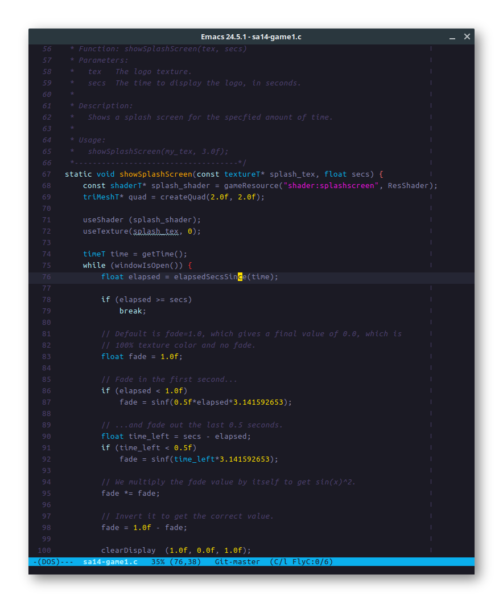

Zweilight Theme for Emacs
######################
This package provides a dark but colorful theme for Emacs. The colors have been
picked carefully to provide a pleasant coding experience in darker environments,
while still maintaining good contrast and highlighting syntax constructs in a
particularly useful manner.

Installation
============

Package.el
----------
The Zweilight theme is available in `MELPA <https://melpa.org>`_.

You can install it with the following command:

:code:`M-x package-install zweilight-theme`

To load it automatically on Emacs startup, add this to your initialization file:

:code:`(load-theme 'zweilight t)`
